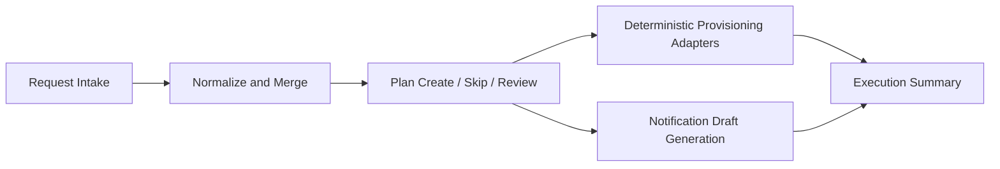

# Enterprise Provisioning Workbench Demo

Sanitized public showcase for a desktop automation workspace that converts repetitive account requests into a deterministic batch workflow.

This repository is the public-safe derivative of a private internal project. It focuses on architecture, workflow design, and safe abstractions without exposing production connectors, internal targets, or sensitive runtime data.

## Positioning

This workbench is a desktop-oriented operator workspace, not a generic AI agent framework.

The product goal is to move operators away from one-by-one request handling and toward:

- batch intake from inbound request sources
- normalized request rows before downstream execution
- deduplication and merge policy before any external write
- explicit `create`, `skip`, or `review` outcomes
- communication artifacts generated from verified results

## High-Level Architecture



### Workspace shell

- launcher-driven tool surfaces
- shared execution entry points
- operator-facing status, logs, and result summaries

### Batch processing layer

- source record ingestion
- row normalization
- deduplication and merge policy
- exception-focused review queues

### Deterministic adapters

- provisioning connectors perform controlled external writes
- notification adapters render communication artifacts
- AI may assist extraction or interpretation, but not final system writes

### Observability

- execution summaries
- replay-friendly telemetry events
- debug bundles kept only in private environments

## Core Operator Flow

1. Read inbound request records.
2. Normalize the input into consistent account rows.
3. Merge duplicates before any downstream write.
4. Decide whether each account should be created, skipped, or reviewed.
5. Execute deterministic provisioning steps.
6. Verify the result.
7. Generate outbound draft communication for valid outcomes.

## Product Design Principles

- batch-first UX
- one primary operator action for the happy path
- exceptions expanded only when needed
- deterministic adapters own external writes
- public documentation stays high-level and sanitized

## Demo App

`demo_app/` is a sanitized Python reference implementation of the architecture above. It demonstrates:

- request normalization
- duplicate merging by account identity
- deterministic action planning
- fake provisioning execution
- draft preview generation

Run the demo:

```bash
python -m demo_app
```

Run the tests:

```bash
python -m unittest discover -s tests
```

## Repository Layout

- `demo_app/`: sanitized Python workflow skeleton
- `docs/architecture-overview.md`: high-level architecture summary
- `docs/interview-story.md`: portfolio framing and interview narrative
- `docs/sanitization-checklist.md`: public release boundary checklist
- `tests/`: public-safe tests for the demo workflow

## Public Safety Boundary

This repository intentionally excludes:

- internal company systems and URLs
- real credentials, cookies, and tokens
- real customer or account data
- raw HTML captures and reverse-engineering traces
- production debug bundles and telemetry payloads

## License

MIT. See `LICENSE`.
