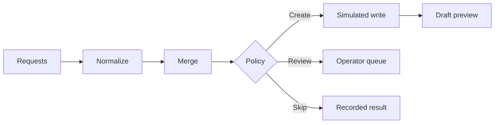

# Enterprise Provisioning Workbench Demo

A runnable, sanitized Python demonstration of a deterministic account-provisioning workflow.

**Status:** public demonstration. The adapters simulate external systems; this repository is not connected to employer infrastructure and does not contain production data or proprietary source code.

## Problem

Account requests often arrive in inconsistent formats and are handled one at a time. That creates duplicate work, unclear decisions, and weak auditability. This demo shows a small workflow that separates intake, normalization, decision policy, execution, and notification.

## Workflow


```mermaid
flowchart LR
    A[Requests] --> B[Normalize]
    B --> C[Merge]
    C --> D{Policy}
    D -->|Create| E[Simulated write]
    D -->|Review| F[Operator queue]
    D -->|Skip| G[Recorded result]
    E --> H[Draft preview]
```

Each request becomes one of three explicit outcomes:

- `CREATE` — validation and policy checks passed
- `REVIEW` — high-impact access or a complex merge needs an operator
- `SKIP` — the provisioning adapter confirms the account already exists

## Design choices

- Immutable dataclasses define the workflow records.
- Source, provisioning, and notification behavior sit behind typed adapter protocols.
- Existing-account checks come from the provisioning adapter instead of a naming convention.
- Normalization happens before deduplication and policy evaluation.
- The public implementation performs simulated writes only.

## Run

Requires Python 3.11 or newer and has no third-party runtime dependencies.

```bash
python -m demo_app --show-stages
```

Create a valid sample input, run it, and save the report:

```bash
python -m demo_app sample --output sample-output/requests.json
python -m demo_app --input sample-output/requests.json --save-report sample-output/run-report.json
```

Run the tests:

```bash
python -m unittest discover -s tests -v
```

## Input contract

```json
{
  "requests": [
    {
      "request_id": "REQ-1001",
      "account_key": "alice.chen",
      "display_name": "Alice Chen",
      "requested_access": "vpn",
      "source_channel": "email"
    }
  ],
  "existing_accounts": ["bob.wu"]
}
```

## Repository layout

- `demo_app/models.py` — immutable workflow records
- `demo_app/adapters.py` — source, provisioning, and notification boundaries
- `demo_app/pipeline.py` — normalization, merge, policy, and orchestration
- `demo_app/__main__.py` — JSON CLI and report export
- `tests/` — unit tests for normalization, decisions, and side-effect boundaries
- `.github/workflows/ci.yml` — tests on Python 3.11 and 3.12

## Public safety boundary

The repository excludes internal URLs, credentials, cookies, customer data, browser traces, production connectors, and operational logs. Names and records in the sample data are fictional.

## License

MIT
